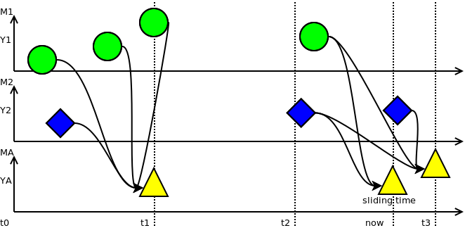
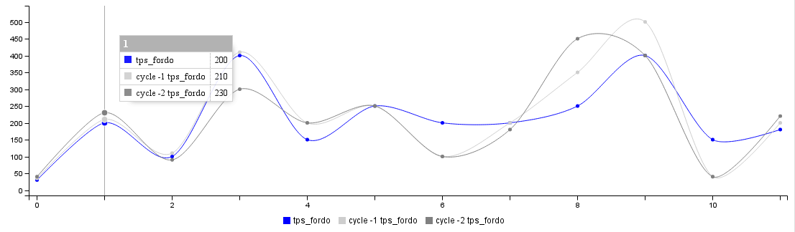
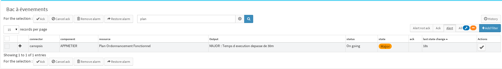
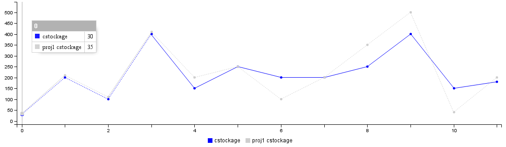
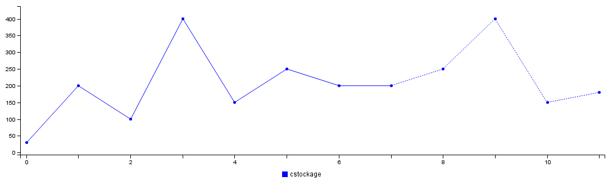
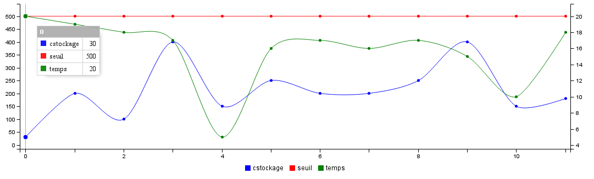
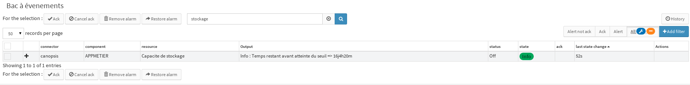
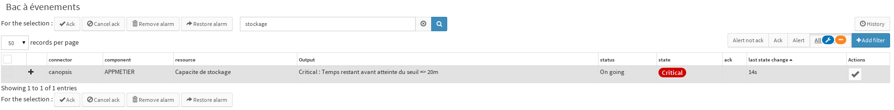

.. _FR__Metric:

======
Metric
======

This document presents metric functional requirements in Canopsis.

.. contents::
   :depth: 4

----------
References
----------

- :ref:`FR::Context <FR__Context>`

.. _entity: FR__Context__Entity_
.. _entities: FR__Context__Entity_

-------
Updates
-------

.. csv-table::
   :header: "Author(s)", "Date", "Version", "Summary", "Accepted by"

   "Jonathan Labéjof and David Delassus", "2015/10/13", "1.0", "Template creation", ""

--------
Contents
--------

.. _FR__Metric__Description:

Description
===========

In Canopsis, a metric denotes an entity_ numerical activity evolution. For example, `RAM quantity` is a metric of a computer.

It uses a unique name per entity_ and is composed of two types of values:

- ponctual values: float value by a timestamp, also named perfdata. For example, `9` can correspond to a RAM consumption quantity.
- periodical values: named property values which cover a time interval. For example, a unit (GB, KM, etc.), a threshold, etc.

Functionalities
===============

Such as an hypervision solution, Canopsis is a metric statistical analysis tool from fined grained to large scale perfdata requirements.

Access to metrics
-----------------

Feeding
~~~~~~~

Feeding the system system **MUST** be possible both unitary/fewly and massively.

- Unitary/fewly (in kB): Could be done thanks to synchronous tools such as an API.
- Massively (in MB): done thanks to (a)synchronous tools which takes as input a file of data or fast asynchronous middleware like a message-oriented middleware.

Timestamp values are not a decisive to the system feeding. It **MUST** be possible to feed the system with past, present and future perfdata.

Retrieving
~~~~~~~~~~

Retrieving metrics from the system is possible thanks to:

- selection timed intervals. 24h past from the retrieving moment by default.
- exclusion timed intervals. Empty by default.
- an entity_.
- a metric name.

The result might be data or a simple textual format for opened file exporting.

Deleting
~~~~~~~~

Deleting metrics is possible in giving:

- a timed interval. If not given, all entity_ metric values with corresponding name will be removed.
- an entity_.
- a metric name.

Aggregation
-----------

Properties
~~~~~~~~~~

An aggregation is an operation which consists to create a new metric from:

- at least one metric.
- a mathematical operator (mean/min/max/delta).
- constant timed period for final perfdata creation with a starting time or a number of period from the aggregation moment.
- a sliding time flag which indicates if the last perfdata value has to be positioned at the aggregation time or not.

The schema below is an example of three vertical metrics over time (X axis) by values (Y axis).

The metric ``MA`` is an aggregated metric from both metrics ``M1`` and ``M2``.

The aggregation interval is of length ``(t0 - t1)``, or ``(t2 - t1)`` or ``(t3 - t2)``. Therefore, the aggregation results about perfdata in ]t0; t1] or in ]t2; t3] are respectively at t1 and t3. The result at ``now`` time exists only if ``sliding time`` is true.

``MA`` has no perfdata at t2 beceause there are no perfdata in ]t1; t2] in ``M1`` and ``M2``.

Finally, all points are not definitive beceause if new perfdata appears in this interval, we **HAVE TO** recalculate ``MA`` values.

Mathematical operators
~~~~~~~~~~~~~~~~~~~~~~

mean/min/max/sum
################

Apply operator on a set of metric(s).

diff/divide/product/pow
########################

Apply operator on a set of metrics. The metric selection order is important.

count
#####

Count number of perfdata in the aggregation interval.

derivative/integral
###################

Do respective derivative/integral calculus of a metrics.

first/last
##########

Keep respectively first/last perfdata.

identity
########

Invert time with values.

invert/logarithm/percentile/offset/scale
########################################

Apply an operation to all perfdata.

- Invert: 1/perfdata
- percentile: perfdata * 100 / max(metric)
- offset: perfdata + constant parameter.
- scale: perfdata * constant parameter.

Baseline
--------

Calculus
~~~~~~~~

The baseline is a form of aggregation about historical values.

The idea is to observe perfdata values related to historical perfdata values, from parameterized cycles.

Therefore, additional parameters are:

- comparison bound(s).

For example:

- metric: functional and scheduling plan about execution time => tps_fordo.
- period: 1 day.
- number of periods: 5.
- operator: Mean.
- bound: 20%.

There is a functional and scheduling plan executing once a night and where the minimal execution time is about 4h.

The idea is to considerate the mean time of last 5 executions of scheduling plan, such as a reference time.

When the metric is published in Canopsis, we compare this execution time with the time of reference. If the difference is more than 20%, Canopsis generates an alarm event in precising that the scheduling plan is out of bounds.

Frontend
~~~~~~~~

Both existing metric and the aggregation result could be shown in the same timechart for comparison reasons.

For example:

From the event pool, published alerts are visible:

Forecasting
-----------

Calculus
~~~~~~~~

The forecast is a form of aggregation which calculates future values, and aims to answer to 2 questions:

- Is real value close to forecasted value ?
- When does a threshold will be reached ?

Additional parameters are:

- maximal forecasting time.
- forecasting algorythm.
- relative alert threshold(s), corresponding to the first answer.
- absolute alert threshold(s), corresponding to the second answer.

Let's take the example of an arbitraty storing capability.

Frontend
~~~~~~~~

Question 1
##########

La réponse à la première question pré suppose que Canopsis implémente et mette à disposition les résultats d'une projection dans le temps de la courbe à laquelle on s'intéresse.
Cette projection sera visible sur un widget de type timechart grâce à un élément graphique différenciant.

Dans un premier cas, cela peut se traduire par 2 courbes distinctes, l'une présentant la série réélle, l'autre la projection.

Dans un second cas, la courbe de projection peut être la suite de la courbe réélle.

Par ailleurs, la motorisation Canopis permettra d'émettre un événement d'alerte si le point actuel est hors bornes par rapport à la projection initiale.
Dans ce cas, un événement dans le bac pourrait être montré à l'exploitant.

Question 2
##########

La réponse à la seconde question repose également sur le principe de la projection et l'atteinte d'un seuil.
L'idée est de projeter la série temporelle jusqu'au point de rupture, c'est-à-dire jusqu'à dépasser un seuil défini.

Dans un premier temps, les résultats seront observables sur un graph

Dans un second temps, les résultats seront visibles sous forme d'événements :

ou encore :

Retention
---------

The retention is a form of aggregation used to keep only useful perfdata for memory consumption concerns.

It is parameterized by at least one aggregation interval.

For example, if we have a metric which produces a perfdata value every minute, and the monitoring usage is about 5 minutes per day, it is useful to keep only 12 metric timed values per hour instead of 60, per day. After one day, the retention tool might keep one perfdata value per day.

Therefore, the retention tool uses 365 + 12 * 24 = 653 / year instead of 365 * 12 * 24 = 105.120 / year.

Consolidation
-------------

The consolidation is just an aggregation of aggregation(s).

Example
=======

.. _FR__Metric__Desc:

Description
-----------

.. warning::

   TODO

.. _FR__Metric__PerfData:

Performance Data
----------------

.. warning::

   TODO

.. _FR__Metric__TimeWindow:

TimeWindow
----------

.. warning::

   TODO

.. _FR__Metric__TimeSerie:

TimeSerie
---------

.. warning::

   TODO
