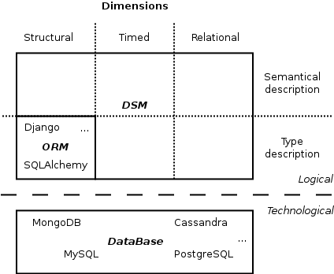

.. _FR__Storage:

=================
Canopsis Storages
=================

This document describes the concept of storage in Canopsis.

.. contents::
   :depth: 2

----------
References
----------

 - :ref:`FR::Middleware <FR__Middleware>`
 - :ref:`FR::Webservice <FR__Webservice>`
 - :ref:`FR::Schema <FR__Schema>`

.. _middleware: FR__Middleware_
.. _schema: FR__Schema_

-------
Updates
-------

.. csv-table::
   :header: "Author(s)", "Date", "Version", "Summary", "Accepted by"

   "Jonathan Labéjof", "2015/11/28", "0.4", "add definition of the **DDSS** with perspectives"
   "David Delassus", "2015/10/20", "0.3", "Update storage definition"
   "David Delassus", "2015/10/20", "0.2", "Add webservice"
   "Jonathan Labéjof", "2015/10/06", "0.1", "Document creation", ""

--------
Contents
--------

.. _FR__Storage__:

Description
===========

A storage is a middleware_ dedicated to access to data in a common way, with dimensional concerns.

.. _FR__Storage__Type:

Dimensions
==========

The Canopsis storages are a **Dimensional Data Storage System**, also called **DDSS**.

Problem
-------

A **DDSS** aims to solve a complex problem which has never been generically solved. In the case where a final user knows exactly if its data has to be historized or ponctually stored, like metric values, the solution of data dimensions is always specific to the system developed, and never reused from a system to another one.

We think this problem has to be solved at a upper abstraction level in order to be reused in several context and make easier the development with code generation and common libraries related to specific final user requirements.

Solution
--------

According to ORM (Object Relational Mapping) solutions, **DDSS** is an abstract layer to access data, whatever database implementation. Except that there are several types of Canopsis storages which focus on the data dimensions, such as time, relational, etc. Instead of focusing only on the data structure like ORM.

The schema below is an overview of dimensions layers about Canopsis Storages and ORM:

In this schema we have two level of concerns, technological and logical, which contain respectively with databases and with dimensions definition.

The logical layer is very important for a system evolution concern. According to common data access interfaces, it becomes possible to let the system choose which databases to use related to physical or timed requirements.

In this view, where an ORM supports only type description in a structural dimension of data, the Canopsis Storage architecture aims to support structural, timed and relational in both semantical and type description of data. The semantical is dedicated to exchange data with not **DDSS** systems.

:warning:
   Actually, none of type and semantical definition are supported, but we work hardely on those two with the schema_ feature. The complex relational is not supported as well, only a composition and reference relationships are supported by a type of storage, but in a next version, a RelationalStorage will be provided in order to extend such relationships.

The solution is divided in several types of storages where all inherits from one (key, value) storage. Therefore, all dimensional data supported by a **DDSS** is identified in a unique way.

Types of Storages
-----------------

A storage is defined by:

 - a protocol: specify the database implementation to use.
 - a data type: specialize the data model with proper data indexes.
 - a data scope: used to separate data according to a scope (example: ``configuration``, ``context``, ``perfdata``, ...)

Here are types of Storages:

- **Storage**: default storage, same behavior than ORMs.
- **PeriodicalStorage**: dedicated to data which have instances which exist on a period of time (for example, Obama is an instance of president which occurred from past 7 years to next... let's "humanity" decide).
- **PonctualStorage**: store data which have an instance at a specific moment. For example, a metric value exists at a moment.
- **CompositeStorage**: specific to typed relational data. For example, a Canopsis resource is embedded by a component. It will evolve into a RelationalStorage soon...
- **FileStorage**: useful to store/access files like a file system.

According to storage types, the implementation must provide the best data model, which is independent from data structures.

Perspectives
------------

Here are some features we are going to develop.

- The CompositeStorage will evolve into a RelationalStorage.
- Data semantical and type definition will come with schema_ improvement.
- Support of multi-dimensional data. With a unique access related to dimensional queries and with dynamical management of dimensions.
- support of additional features such as transactions, mapreduce, etc. will be provided in order to enrich queries.

.. _FR__Storage__Webservice:

Serving storages
================

A :ref:`webservice <FR__Webservice>` **SHOULD** provide CRUD access to each storage.

The URL **SHOULD** be ``/storage/<protocol>/<data_type>/<data_scope>`` and each method
**SHOULD** resolve to the corresponding storage and CRUD operation.
